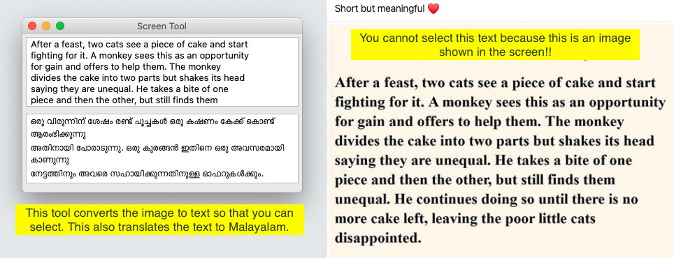

# mac-utils
Mac-utils is a utility library for Mac computers

## ScreenTools.py - copy text from image
Do you ever need to copy text from an image shown in a browser or from any windows shown in your mac? Do you want to capture the text and translate that to any language? You can use this simple script for that!!

ScreenTools.py can be used to capture text from the screen. It also translates that text to Malayalam.

#### Installation
Install OpenCV
`pip install opencv-python`

Install PyTesseract
`pip install pytesseract`

Install wxPython
`pip install wxpython`

Install requests
`pip3 install requests`

Install tesseract
`brew reinstall tesseract`

That's all. Then run `ScreenTools.py`. Your mouse pointer will turn into a selection pointer, you can select any portion form the screen. After selection, this program will capture the text from that selected area, display it in a window. Now you can select that text. This also translates the text to Malayalam.

#### Add a shortcut key
You can add a shortcut key using Automator. Open Automator app. In search box, type 'shell'. Drag 'Run Shell Script' and point to your python script location like the below image. Save the automator script.

Open 'System Preferences'. Open keyboard. Select 'Shortcuts'. Select 'Services' from the left panel. Scroll down to 'General' in the right panel. Select the Automator script name. Select a key combination. I selecyed 'command+control+m'.

Thats all. Enjoy!!!

**IMPORTANT** - you may need to edit the script to point to tesseract library if you get **'TesseractNotFoundError'**. Find out tesseract location using `brew list tesseract`, then give that location by adding the following line after import statments (line #11).
`pytesseract.pytesseract.tesseract_cmd="/usr/local/Cellar/tesseract/4.1.1/bin/tesseract"`

